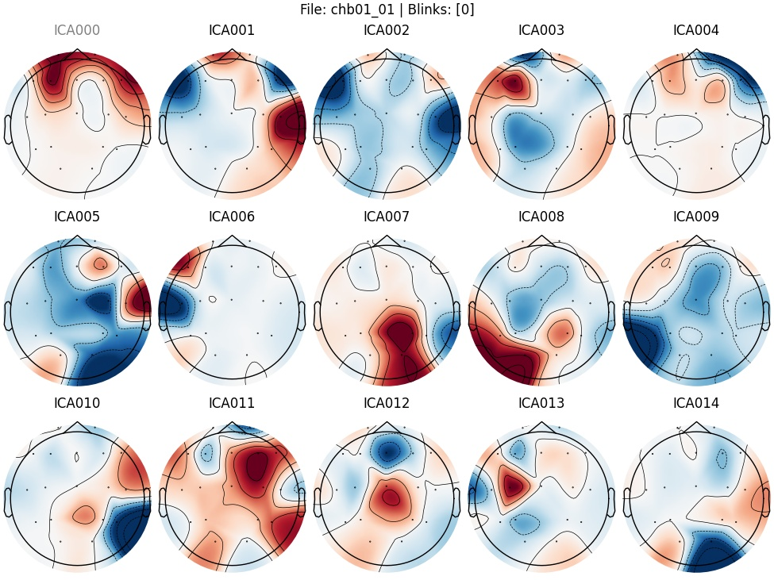
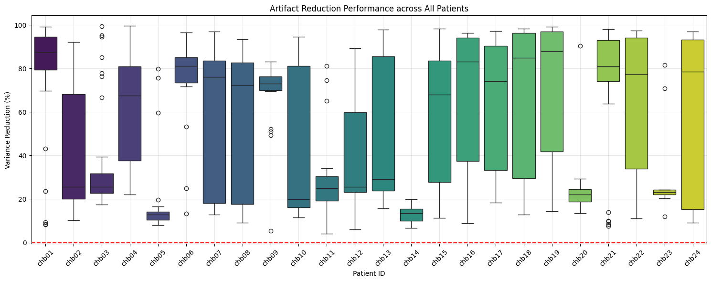
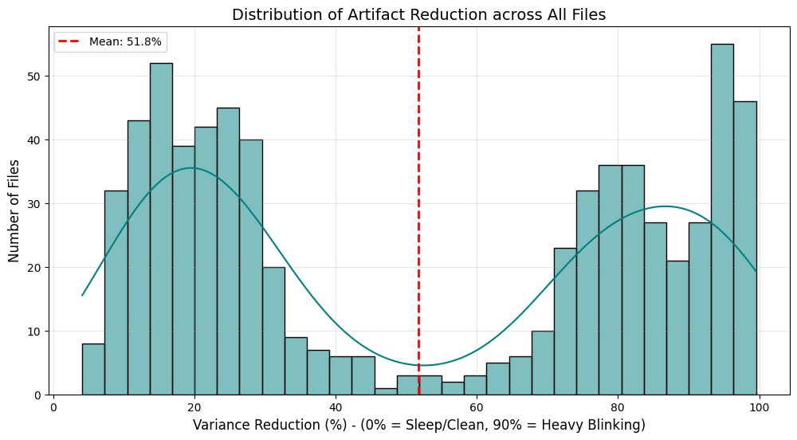

# EEG Artifact Removal with ICA (CHB-MIT, MNE-Python)

**Authors:** Daniel Noroozi, Samira Sadeghi  
**Context:** Digital Signal and Image Management (university course project)

This repository contains an end-to-end EEG preprocessing pipeline built on **MNE-Python** to clean CHB-MIT scalp EEG recordings using **ICA (Independent Component Analysis)** and generate **per-file ICA diagnostics** plus a **global quality-control (QC) report**.

> Important: This repo does **not** include CHB-MIT raw EDF files. You must download the dataset separately and point the scripts to your local dataset path.

---

## What this project does

For each EEG recording (`.edf`) in CHB-MIT:

1. **Load EDF** and suppress date-related warnings (`raw.set_meas_date(None)`).
2. **Standardize channel names** with a robust mapping + collision handling (`safe_rename_and_pick`).
3. **Select a consistent 10–20 subset** (19 channels target list; skip files with too few valid channels).
4. **Set montage** (`standard_1020`) when possible.
5. **Filter**
   - Notch: **60 Hz** (mains interference)
   - Bandpass: **1–40 Hz**
6. **Fit ICA** (up to 15 components, based on channel rank).
7. **Auto-detect blink-related components** (heuristic: EOG scoring using **Fp1** when available).
8. **Apply ICA**, then **save**
   - Cleaned EEG as **FIF** (`clean_{file}_eeg.fif`)
   - ICA component plot as PNG (`{file}_ica.png`)

Finally, the pipeline builds a **global QC report** over all processed recordings.

---

## Outputs

After running, you will get:

- `ProcessedDataset/Cleaned_Data/chbXX/clean_chbXX_YY_eeg.fif`  
- `ProcessedDataset/ICA_Reports/chbXX/chbXX_YY_ica.png`  
- `ProcessedDataset/Global_Quality_Report.csv` (derived QC metrics)  
- Optional QC figures (boxplot + histogram) if you generate them in your notebook.

Example visuals (from this project run):

| ICA components | Before vs after (time + PSD) |
|---|---|
|  |  |

| QC by patient | QC distribution |
|---|---|
|  |  |

---

## Dataset

- **CHB-MIT Scalp EEG Database** (PhysioNet)

Download it locally so you have folders like:

```
Dataset/CHB-MIT/
  chb01/
    chb01_01.edf
    ...
  chb24/
    ...
```

---

## Installation

Create an environment and install dependencies:

```bash
pip install -r requirements.txt
```

---

## How to run

### 1) Batch clean all patients (chb01 → chb24)

```bash
python scripts/run_all_patients.py --dataset_root Dataset/CHB-MIT --processed_root ProcessedDataset
```

### 2) Build the global QC CSV report

```bash
python scripts/build_global_qc_report.py --dataset_root Dataset/CHB-MIT --cleaned_root ProcessedDataset/Cleaned_Data --out_csv ProcessedDataset/Global_Quality_Report.csv
```

### 3) Visual QC for a single file (time series + PSD)

```bash
python scripts/qc_single_example.py --raw Dataset/CHB-MIT/chb01/chb01_01.edf --clean ProcessedDataset/Cleaned_Data/chb01/clean_chb01_01_eeg.fif
```

---

## Quality-control metrics (what they mean)

This project uses **simple, interpretable proxies** to summarize cleaning:

- **Variance reduction (%)**

Variance reduction (%) = 100 * (1 - Var(clean) / Var(raw))

Intuition: large motion/blink artifacts often inflate variance, so cleaning should reduce it.


- **Kurtosis** (spikiness)  
  Artifacts often create heavy tails/spikes → kurtosis can shift after cleaning.

- **Estimated SNR (dB)**  
  Treat **noise ≈ raw − clean** and compute power ratio.

### Results from the included report (derived)

This repo includes a derived CSV produced by the pipeline (no raw EEG):

- Patients processed (in report): **24**
- Files in report: **685**
- Variance reduction proxy (all files):
  - Mean: **51.79%**
  - Median: **40.77%**
  - Std: **33.19%**
  - Min / Max: **4.14% / 99.56%**

> Note: These QC metrics are **not clinical validation**. They are lightweight proxies to help spot failures and compare recordings at scale.

---

## Design highlights

- **Anti-collision channel mapping**  
  CHB-MIT channels can contain duplicates/variants (e.g., `T8-P8-0`, `T8-P8-1`).  
  The `safe_rename_and_pick()` function standardizes names and drops collisions safely.

- **Scalable batch processing**  
  Per-patient output folders keep artifacts, reports, and cleaned files organized.

- **Human-readable diagnostics**  
  Saving ICA component plots makes it easy to audit what the model is removing.

---

## Known limitations (honest engineering section)

1. **Channel comparability in QC:**  
   CHB-MIT raw channels are often **bipolar derivations** (e.g., `FP1-F7`), while cleaned channels are renamed to **single labels** (e.g., `Fp1`).  
   The current QC is a *useful proxy*, but strict apples-to-apples comparisons require computing QC on the same signal definition.

2. **Blink detection is heuristic:**  
   Using `Fp1` for EOG scoring works well for many recordings, but it is not a full EOG setup.

3. **No seizure modeling here:**  
   This repo focuses on preprocessing/QC, not downstream seizure detection.

---

## Collaboration

This project was developed collaboratively by:

- **Daniel Noroozi** 
- **Samira Sadeghi** 

---

## License

MIT License (see `LICENSE`).
